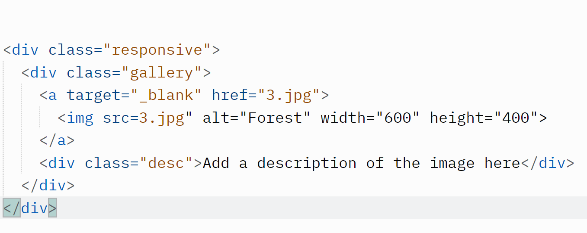
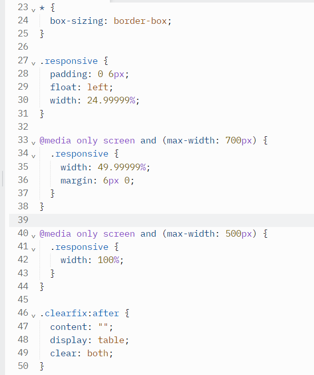
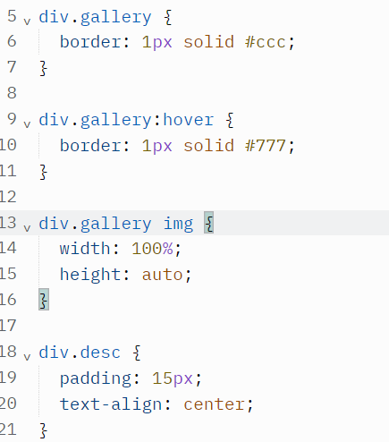

# media queries to re-arrange the images on different screen sizes: for screens larger than 700px wide, it will show four images side by side, for screens smaller than 700px, it will show two images side by side. For screens smaller than 500px, the images will stack vertically (100%)  

  ## Steps
  1. Create a basic HTML Lab template
  2. Link to main CSS
  3. Create a lab13.css
  4. Use Class sample to code the image gallery
    

  For example, here is a code block for image Gallery div

  
  